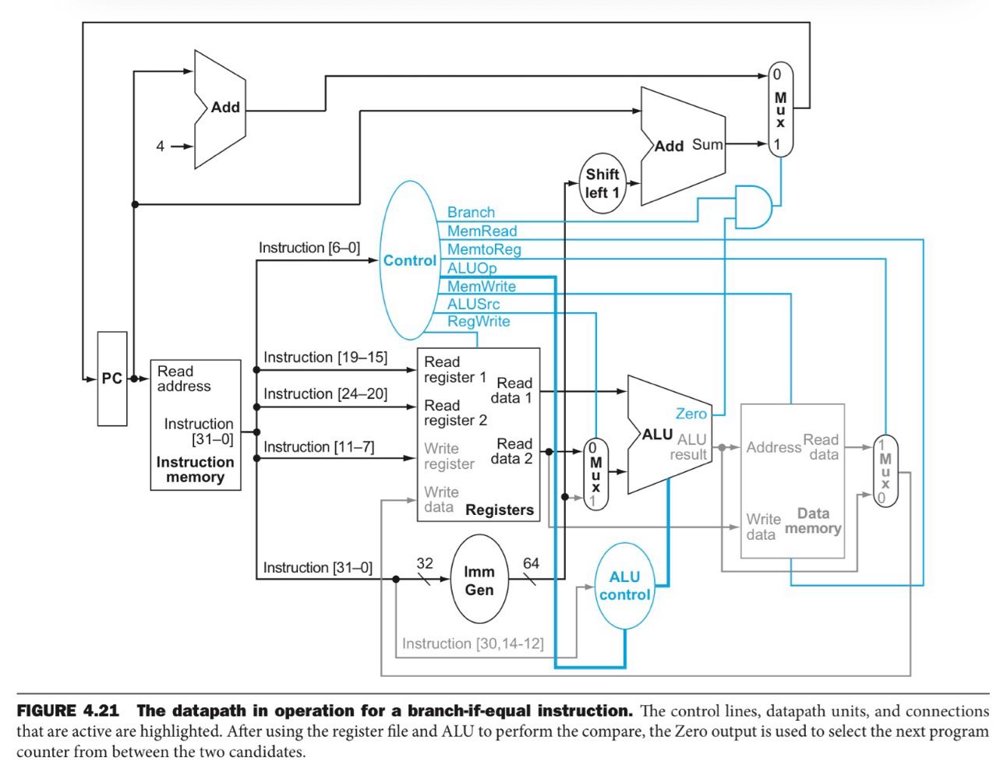

<div align="center">

# RV64I Single-Cycle Core

Implementación RTL de un procesador RISC-V de 64 bits con datapath monociclo,
unidad de control, ALU, banco de registros y memorias de instrucciones y datos.




**[Ver el RTL](rtl/)** ·
**[Leer las notas de arquitectura](docs/chapter4_single_cycle_notes.md)**

</div>

## Descripción

Este proyecto implementa un núcleo RISC-V RV64I de propósito educativo. El
datapath sigue la organización monociclo presentada en el Capítulo 4 de
*Computer Organization and Design: The Hardware/Software Interface — RISC-V
Edition*.

La implementación conecta el contador de programa, la memoria de
instrucciones, el banco de registros, el generador de inmediatos, la ALU, la
memoria de datos, los multiplexores y la lógica de control en un único
datapath.

## Microarquitectura

La imagen superior muestra la arquitectura de referencia que se está
implementando. El flujo principal es:

1. El `PC` direcciona la memoria de instrucciones.
2. La unidad de control decodifica el `opcode`.
3. El banco de registros entrega `rs1` y `rs2`.
4. `ImmGen` genera y extiende el inmediato cuando la instrucción lo requiere.
5. La ALU calcula una operación, una dirección efectiva o la comparación de
   un branch.
6. La memoria de datos y el mux de writeback completan `ld` y `sd`.
7. `Branch AND Zero` selecciona entre `PC + 4` y el destino de `beq`.

## Instrucciones implementadas

| Clase | Instrucciones | Función principal |
|---|---|---|
| R-type | `add`, `sub`, `and`, `or` | Operaciones entre dos registros |
| I-type | `ld` | Cálculo de dirección y lectura de un doubleword |
| S-type | `sd` | Cálculo de dirección y escritura de un doubleword |
| B-type | `beq` | Branch relativo si dos registros son iguales |

## Estructura del proyecto

```text
rtl/
├── riscv_core.v     # Datapath principal y conexiones del core
├── pc.v             # Contador de programa
├── inst_mem.v       # Memoria de instrucciones
├── control_unit.v   # Unidad de control principal
├── imm_gen.v        # Generador de inmediatos
├── file_register.v  # Banco de 32 registros de 64 bits
├── alu_control.v    # Decodificación de la operación de la ALU
├── alu.v             # Unidad aritmético-lógica
├── adder.v           # Sumador de 64 bits
├── mux2_1.v          # Multiplexor 2:1 de 64 bits
└── data_mem.v       # Memoria de datos

docs/
├── images/
│   └── riscv-single-cycle-datapath.png
└── chapter4_single_cycle_notes.md

testbench/           # Banco de pruebas en desarrollo
```

## Uso rápido

Para comprobar la sintaxis del RTL con Icarus Verilog:

```bash
iverilog -g2012 -Wall -s core -o /tmp/riscv_core.vvp rtl/*.v
```

La memoria de instrucciones contiene una secuencia inicial de prueba con
`sd`, `ld`, `add`, `sub`, `and`, `or` y `beq`.

## Estado actual

- Datapath monociclo conectado.
- Control principal para `ld`, `sd`, `add`, `sub`, `and`, `or` y `beq`.
- Lectura combinacional de registros y memoria de datos.
- Escritura sincronizada del PC, registros y memoria de datos.
- Testbench completo pendiente de desarrollo.

## Fuente de la arquitectura

La microarquitectura se basa en el Capítulo 4, secciones 4.1–4.4, de:

> David A. Patterson y John L. Hennessy, *Computer Organization and Design:
> The Hardware/Software Interface — RISC-V Edition*.

El libro se utiliza como referencia de diseño.

## Autor

- [IPrometheusI](https://github.com/IPrometheusI)
